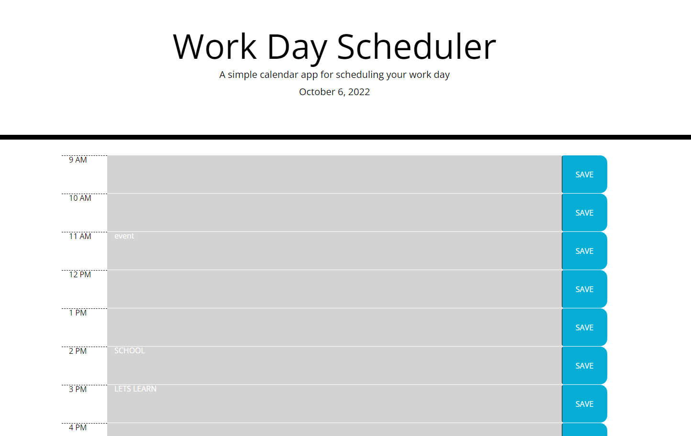

# Work Day Scheduler

## Summary

This project sets out to create a daily hourly scheduling tool for organizing a given day's work. This project makes use of the jQuery and moment.js libraries. The schedule uses the moment.js library to retrieve the current date and time and uses that to indicate whether events are in the past present or future. It also makes use of bootstrap tools for consistent formatting.

A user can click on an hour block and input text. Upon clicking the save button, the entered text will be saved into local storage and be retrieved the next time the page loads. The time spans the hours 9AM to 6PM.

The live site can be accessed at: https://dbanfieldkeller.github.io/work-day-scheduler/

When viewed the page should appear as below(screenshot taken at 8:35pm): 